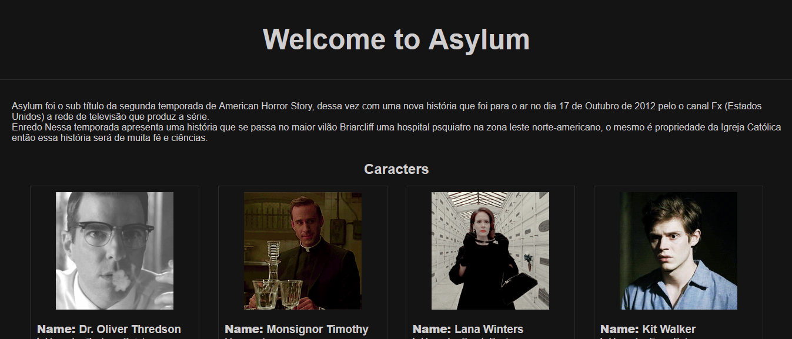

# 🧠 AHS: Asylum

<h3 align="center">
Como sou fã da série American Horror Story, e minha temporada favorita é Asylum, resolvi desenvolver uma API baseada nela.
</h3>

---

## 📌 Sobre o projeto

Este projeto foi criado com o objetivo de consumir uma API baseada na temporada **Asylum** da série American Horror Story.

Na prática, foram desenvolvidos **dois projetos**:

* 🔹 Uma API responsável por fornecer os dados dos personagens
* 🔹 Este projeto, responsável por consumir e exibir essas informações

A ideia foi unir prática de desenvolvimento com algo que eu gosto, tornando o aprendizado mais interessante.

---

## 🚀 Funcionalidades

* Consumo de API REST
* Exibição de personagens da temporada *Asylum*
* Estrutura simples e direta
* Projeto ideal para estudos de integração frontend ↔ backend

---

## 🛠️ Tecnologias utilizadas

* HTML
* CSS
* JavaScript
* Consumo de API via fetch

---

## 🔗 Integração com API

Este projeto consome dados de uma API própria desenvolvida separadamente.

👉 Endpoint utilizado:
https://api-ahs.vercel.app/
---

## 🖼️ Preview do projeto

---

## 🎯 Objetivo do projeto

* Praticar consumo de APIs
* Trabalhar com requisições HTTP
* Estruturar melhor projetos separados (API + cliente)
* Desenvolver algo baseado em interesse pessoal

---

## 🔮 Melhorias futuras

* Melhorar o layout e responsividade
* Adicionar filtros de personagens
* Implementar busca
* Melhor tratamento de erros da API
* Deploy com domínio personalizado

---

## 💡 Considerações finais

Esse projeto foi desenvolvido com foco em estudo, mas também como uma forma de trazer um tema que eu gosto muito para a prática.

Além disso, ele faz parte de um conjunto maior (API + consumo), ajudando a entender melhor como aplicações se comunicam no mundo real 🌐

